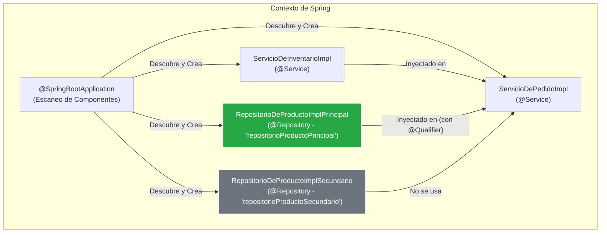

***
# Sistema de Gestión de Pedidos - Demo de Inyección de Dependencias en Spring

Este proyecto es una aplicación de demostración construida con Spring Boot que ilustra un concepto fundamental y muy común en el desarrollo de software: la **inyección de dependencias (DI)** y la **resolución de ambigüedad** cuando existen múltiples implementaciones para una misma interfaz.

El objetivo es ofrecer un caso de estudio práctico y claro sobre cómo el contenedor de Inversión de Control (IoC) de Spring gestiona y "cablea" los componentes de una aplicación.

-----

## Conceptos Clave Demostrados

Esta aplicación sirve como un ejemplo práctico para los siguientes conceptos de Spring:

* **Inyección de Dependencias por Constructor**: La práctica recomendada para inyectar dependencias obligatorias.
* **Ambigüedad en la Inyección**: El escenario donde múltiples beans (`@Repository`) implementan la misma interfaz (`IRepositorioDeProducto`).
* **Resolución de Ambigüedad con `@Qualifier`**: Cómo indicarle a Spring exactamente cuál bean inyectar cuando hay varias opciones disponibles.
* **Estereotipos de Spring**: Uso de anotaciones como `@Service` y `@Repository` para definir el rol de cada componente.
* **Escaneo de Componentes**: Cómo `@SpringBootApplication` descubre y registra automáticamente los beans.
* **Programación Orientada a Interfaces**: Definir contratos claros (`IRepositorioDeProducto`, `IServicioDeInventario`) que son implementados por clases concretas.
* **Logging Profesional**: Uso de SLF4J para un registro de eventos robusto y configurable.

-----

## Arquitectura y Flujo de Inyección

El núcleo de la demostración reside en cómo se construye el `ServicioDePedidoImpl`. Este servicio necesita dos colaboradores (dependencias) para funcionar: un servicio de inventario y un repositorio de productos.

1.  **`IServicioDeInventario`**: Solo existe una implementación (`ServicioDeInventarioImpl`), por lo que Spring puede inyectarla sin ambigüedad.
2.  **`IRepositorioDeProducto`**: Existen dos implementaciones (`RepositorioDeProductoImplPrincipal` y `RepositorioDeProductoImplSecundario`). Esto crea una ambigüedad.
3.  **Solución**: Usamos `@Qualifier("repositorioProductoPrincipal")` en el constructor de `ServicioDePedidoImpl` para especificar explícitamente que queremos la implementación principal.

-----

## Diagrama de Inyección de Dependencias



-----

## Estructura del Proyecto

```text
src/main/java/com/example/p9/
├── PrincipalAplicacionPedidos.java  # Punto de entrada de la aplicación
├── interfaz/
│   ├── IRepositorioDeProducto.java  # Contrato para repositorios de productos
│   ├── IServicioDeInventario.java   # Contrato para el servicio de inventario
│   └── IServicioDePedido.java       # Contrato para el servicio de pedidos
├── repositorio/
│   ├── RepositorioDeProductoImplPrincipal.java   # Implementación principal (Bean: 'repositorioProductoPrincipal')
│   └── RepositorioDeProductoImplSecundario.java  # Implementación secundaria (Bean: 'repositorioProductoSecundario')
└── servicio/
    ├── ServicioDeInventarioImpl.java  # Implementación del servicio de inventario
    └── ServicioDePedidoImpl.java      # Servicio principal que recibe las dependencias
```

-----

## Cómo Ejecutar el Proyecto

### Prerrequisitos

* JDK 17 o superior.
* Apache Maven 3.8 o superior.

### Pasos

1.  Clona este repositorio en tu máquina local.
2.  Abre una terminal o línea de comandos en el directorio raíz del proyecto (donde se encuentra el archivo `pom.xml`).
3.  Ejecuta el siguiente comando de Maven para compilar y arrancar la aplicación:
    ```bash
    mvn spring-boot:run
    ```
4.  Observa la salida en la consola para verificar el comportamiento del ciclo de vida y la inyección de dependencias.

-----

## Salida Esperada en Consola

La salida en la consola demostrará claramente la secuencia de eventos. Presta especial atención a los mensajes de "Cableado", que confirman qué instancias se están inyectando.

```log
INFO --- [main] com.example.p9.PrincipalAplicacionPedidos      : Iniciando la aplicación de gestión de pedidos...
...
INFO --- [main] c.e.p.s.ServicioDePedidoImpl                   : Cableado: IServicioDeInventario inyectado via constructor. Instancia: ServicioDeInventarioImpl
INFO --- [main] c.e.p.s.ServicioDePedidoImpl                   : Cableado: IRepositorioDeProducto inyectado via constructor con @Qualifier('repositorioProductoPrincipal'). Instancia: RepositorioDeProductoImplPrincipal
...
INFO --- [main] com.example.p9.PrincipalAplicacionPedidos      : Contexto de Spring inicializado correctamente.
INFO --- [main] com.example.p9.PrincipalAplicacionPedidos      : Bean de IServicioDePedido obtenido del contexto.

INFO --- [main] c.e.p.s.ServicioDePedidoImpl                   : 
--- Procesando Nuevo Pedido ---
INFO --- [main] c.e.p.s.ServicioDePedidoImpl                   : Producto: Monitor Curvo Ultrawide, Cantidad: 1
INFO --- [main] c.e.p.r.RepositorioDeProductoImplPrincipal     : Repositorio Principal: Guardando producto -> Monitor Curvo Ultrawide
INFO --- [main] c.e.p.s.ServicioDeInventarioImpl               : Servicio Inventario: Actualizando Stock para 'Monitor Curvo Ultrawide' con 1 unidades.
INFO --- [main] c.e.p.s.ServicioDePedidoImpl                   : Pedido para 'Monitor Curvo Ultrawide' procesado exitosamente.
INFO --- [main] c.e.p.s.ServicioDePedidoImpl                   : --------------------------------

... (se repite para el segundo pedido) ...

INFO --- [main] com.example.p9.PrincipalAplicacionPedidos      : Aplicación de pedidos finalizada y contexto cerrado.
```