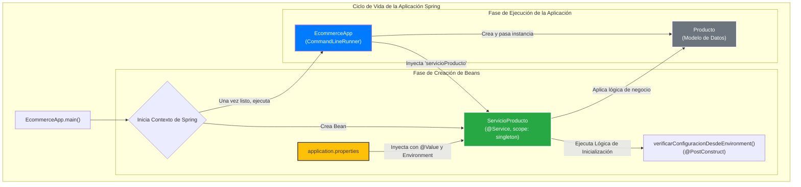

***
# Demo: Gestión de Configuración en Spring Boot

Este proyecto es una aplicación de consola construida con Spring Boot que sirve como una demostración práctica de la **gestión de configuración de propiedades**. El objetivo es ilustrar cómo una aplicación puede cargar y utilizar valores desde archivos `.properties` para modular su comportamiento, una práctica fundamental en el desarrollo de software moderno.

El caso de uso es un sistema simple de gestión de inventario para un e-commerce, donde se generan códigos de producto dinámicamente basados en reglas definidas en un archivo de configuración.

-----

## ✨ Conceptos Clave Demostrados

Esta aplicación es un excelente ejemplo para entender los siguientes conceptos de Spring y buenas prácticas:

* **Gestión de Propiedades Externas**: Uso de `application.properties` para externalizar la configuración, permitiendo modificar el comportamiento de la aplicación sin cambiar el código fuente.
* **Inyección de Valores con `@Value`**: La forma más directa de inyectar valores de propiedades en los campos de un bean, ideal para dependencias de configuración simples.
* **Acceso Programático con la Interfaz `Environment`**: Un enfoque más flexible para consultar propiedades, verificar su existencia y obtenerlas con un tipo de dato específico.
* **Ciclo de Vida de Beans (`@PostConstruct`)**: Demuestra cómo ejecutar lógica de inicialización (como una verificación de configuración) justo después de que un bean ha sido construido y sus dependencias han sido inyectadas.
* **Inyección de Dependencias**: Uso de `@Autowired` para que el contenedor de Spring gestione la creación e inyección de beans (`ServicioProducto`).
* **Ejecución de Lógica al Arranque (`CommandLineRunner`)**: La mejor práctica para ejecutar código de demostración o tareas de inicialización una vez que el contexto de la aplicación está completamente cargado.
* **Logging con SLF4J**: Utilización de un framework de logging estándar en la industria para registrar información, advertencias y errores de manera estructurada.

-----

## 🏗️ Estructura del Proyecto

El proyecto está organizado de forma lógica, separando el modelo de datos, la lógica de servicio y la clase principal de la aplicación.

```text
.
└── src
    └── main
        ├── java
        │   └── com
        │       └── example
        │           └── p1
        │               ├── Application.java            # (Redundante) Clase de arranque de Spring Boot
        │               ├── EcommerceApp.java           # Clase principal con la lógica de la demo (CommandLineRunner)
        │               ├── modelo
        │               │   └── Producto.java           # El POJO que representa un producto
        │               └── servicio
        │                   └── ServicioProducto.java     # Servicio con la lógica de negocio
        └── resources
            └── application.properties        # Archivo de configuración central
```

-----

## 🔗 Diagrama de Dependencias Clave

El siguiente diagrama ilustra el ciclo de vida y las relaciones entre los componentes principales del proyecto.



### Explicación del Flujo:

1.  **Inicio**: La ejecución de `EcommerceApp.main()` inicia el contenedor de Spring.
2.  **Fase de Creación de Beans**:
    * Spring detecta `ServicioProducto` y lo crea como un bean singleton.
    * Lee `application.properties` e inyecta los valores de configuración en `ServicioProducto` a través de `@Value` y la interfaz `Environment`.
    * Una vez que el bean está completamente configurado, se ejecuta el método `verificarConfiguracionDesdeEnvironment()` gracias a la anotación `@PostConstruct`.
3.  **Fase de Ejecución**:
    * Cuando el contexto está listo, Spring ejecuta el método `run()` de `EcommerceApp` (por ser un `CommandLineRunner`).
    * `EcommerceApp` ya tiene una instancia de `ServicioProducto` inyectada.
    * Dentro del método `run()`, se crean instancias del modelo `Producto` y se le pasan al `ServicioProducto` para que aplique la lógica de negocio.

-----

## ⚙️ Cómo Funciona

El flujo de la aplicación es el siguiente:

1.  **Arranque**: Spring Boot inicia la aplicación, escanea los componentes (`@Service`, `@SpringBootApplication`) y los registra como beans.
2.  **Inyección de Configuración**: El `ServicioProducto` es creado. Spring inyecta los valores desde `application.properties` en los campos anotados con `@Value` (ej. `prefijoCategoria`, `umbralBajoStock`).
3.  **Verificación Post-Construcción**: Justo después de la creación del `ServicioProducto`, el método anotado con `@PostConstruct` se ejecuta, demostrando cómo leer las mismas propiedades usando la interfaz `Environment`.
4.  **Ejecución de la Demo**: La clase `EcommerceApp` (que implementa `CommandLineRunner`) ejecuta su método `run()`.
5.  **Lógica de Negocio**:
    * Se crean varias instancias de `Producto` con diferentes niveles de stock.
    * Se llama a `servicioProducto.guardarProducto()` para cada uno.
    * El servicio utiliza el `umbralBajoStock` inyectado para determinar si el stock es bajo.
    * Genera un `codigoInventario` único combinando el prefijo, un ID simulado y un sufijo basado en el estado del stock.
6.  **Salida**: Todos los pasos y resultados se registran en la consola utilizando SLF4J.

-----

## 🚀 Cómo Ejecutar el Proyecto

### Prerrequisitos

* JDK 17 o superior.
* Apache Maven 3.8 o superior.

### Pasos

1.  Clona este repositorio en tu máquina local.
2.  Abre una terminal o línea de comandos en el directorio raíz del proyecto (donde se encuentra el archivo `pom.xml`).
3.  Ejecuta el siguiente comando de Maven para compilar y arrancar la aplicación:
    ```bash
    mvn spring-boot:run
    ```
4.  Observa la salida en la consola para verificar el comportamiento de la aplicación.

-----

## 📋 Salida Esperada en Consola

La salida en la consola mostrará claramente la secuencia de eventos, desde la verificación de la configuración hasta el guardado de cada producto.

```log
// --- Fase de inicialización del bean ServicioProducto ---
INFO --- [              main] c.e.p.servicio.ServicioProducto      : --- Verificación de Configuración de Propiedades (vía Environment) ---
INFO --- [              main] c.e.p.servicio.ServicioProducto      : Prefijo de categoría recuperado: CAT-
INFO --- [              main] c.e.p.servicio.ServicioProducto      : Umbral de bajo stock recuperado: 10
INFO --- [              main] c.e.p.servicio.ServicioProducto      : Sufijo 'PRODUCTO_RETIRADO' (no existente): NO_DEFINIDO
INFO --- [              main] c.e.p.servicio.ServicioProducto      : --- Fin Verificación de Configuración ---

// --- Fase de ejecución de la lógica de la aplicación (CommandLineRunner) ---
INFO --- [              main] com.example.p1.EcommerceApp          : --- Iniciando simulación de gestión de productos ---
INFO --- [              main] c.e.p.servicio.ServicioProducto      : Preparando para guardar producto: Laptop Gamer 'Omega'
INFO --- [              main] c.e.p.servicio.ServicioProducto      : Producto Laptop Gamer 'Omega' guardado con ID: 1 y Código de Inventario: CAT-1-EN_STOCK
INFO --- [              main] com.example.p1.EcommerceApp          : Resultado: Producto(id=1, nombre=Laptop Gamer 'Omega', descripcion=Laptop de alto rendimiento para juegos, stock=25, codigoInventario=CAT-1-EN_STOCK, fechaCreacion=...)

INFO --- [              main] c.e.p.servicio.ServicioProducto      : Preparando para guardar producto: Ratón Ergonómico 'Precisión'
WARN --- [              main] c.e.p.servicio.ServicioProducto      : ¡Producto Ratón Ergonómico 'Precisión' con stock bajo! Cantidad: 8
INFO --- [              main] c.e.p.servicio.ServicioProducto      : Producto Ratón Ergonómico 'Precisión' guardado con ID: 2 y Código de Inventario: CAT-2-STOCK_BAJO
INFO --- [              main] com.example.p1.EcommerceApp          : Resultado: Producto(id=2, nombre=Ratón Ergonómico 'Precisión', descripcion=Ratón inalámbrico con diseño ergonómico, stock=8, codigoInventario=CAT-2-STOCK_BAJO, fechaCreacion=...)

INFO --- [              main] c.e.p.servicio.ServicioProducto      : Preparando para guardar producto: Teclado Mecánico 'Dominator'
WARN --- [              main] c.e.p.servicio.ServicioProducto      : ¡Producto Teclado Mecánico 'Dominator' con stock bajo! Cantidad: 3
INFO --- [              main] c.e.p.servicio.ServicioProducto      : Producto Teclado Mecánico 'Dominator' guardado con ID: 3 y Código de Inventario: CAT-3-STOCK_BAJO
INFO --- [              main] com.example.p1.EcommerceApp          : Resultado: Producto(id=3, nombre=Teclado Mecánico 'Dominator', descripcion=Teclado RGB retroiluminado, stock=3, codigoInventario=CAT-3-STOCK_BAJO, fechaCreacion=...)

INFO --- [              main] com.example.p1.EcommerceApp          : --- Simulación de gestión de productos finalizada ---
```