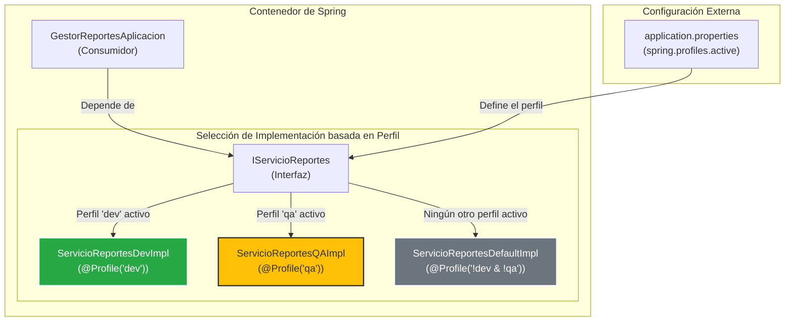

***
# Spring Boot: Creación Condicional de Beans con Perfiles

Este proyecto es una demostración avanzada de una de las características más potentes de Spring Boot: la **creación condicional de beans mediante perfiles (`@Profile`)**. El objetivo es ilustrar cómo una aplicación puede seleccionar dinámicamente una implementación de servicio específica en tiempo de ejecución, basándose en el entorno activo (desarrollo, QA, producción, etc.).

El caso de uso es un sistema que genera reportes, donde la fuente de datos y la lógica de generación cambian según el perfil con el que se ejecute la aplicación.

-----

## ✨ Conceptos Clave Demostrados

Este proyecto es un excelente ejemplo para entender los siguientes conceptos de Spring y buenas prácticas de ingeniería de software:

* **Inversión de Control (IoC) y Principio de Inversión de Dependencias**: La aplicación depende de una abstracción (`IServicioReportes`) en lugar de implementaciones concretas.
* **Perfiles de Spring (`@Profile`)**: El mecanismo central para registrar beans condicionalmente. Se demuestra el uso de perfiles simples (`dev`, `qa`) y expresiones de perfil complejas (`!dev & !qa`).
* **Inyección de Dependencias**: El contenedor de Spring inyecta la implementación correcta de `IServicioReportes` en el consumidor (`GestorReportesAplicacion`) sin que este necesite conocer los detalles.
* **Programación Orientada a Interfaces**: Se define un contrato claro (`IServicioReportes`) que todas las implementaciones deben cumplir, permitiendo intercambiarlas de forma transparente.
* **Ejecución de Lógica al Arranque (`CommandLineRunner`)**: La mejor práctica para ejecutar código de demostración o tareas de inicialización una vez que el contexto de la aplicación está completamente cargado.
* **Logging Estructurado (SLF4J)**: Uso del framework de logging estándar para proporcionar una visibilidad clara del comportamiento de la aplicación.
* **Reducción de Código Repetitivo (Lombok)**: Uso de anotaciones como `@Data` y `@AllArgsConstructor` para mantener las clases del modelo limpias y concisas.

-----

## 🏗️ Estructura del Proyecto

El proyecto sigue una estructura limpia y bien definida que separa las responsabilidades.

```text
.
└── src
    └── main
        ├── java
        │   └── com
        │       └── example
        │           └── p2
        │               ├── GestorReportesAplicacion.java # El consumidor que ejecuta la demo (CommandLineRunner)
        │               ├── interfaz
        │               │   └── IServicioReportes.java    # El contrato del servicio
        │               ├── modelo
        │               │   ├── DetalleReporte.java     # POJO para los detalles
        │               │   └── Reporte.java            # POJO para el reporte principal
        │               └── servicio
        │                   ├── ServicioReportesDefaultImpl.java # Implementación por defecto
        │                   ├── ServicioReportesDevImpl.java     # Implementación para el perfil 'dev'
        │                   └── ServicioReportesQAImpl.java      # Implementación para el perfil 'qa'
        └── resources
            └── application.properties           # Archivo de configuración central
```

-----

## 🔗 Diagrama de Dependencias Clave

El siguiente diagrama ilustra cómo Spring selecciona la implementación correcta de `IServicioReportes` basándose en el perfil activo.



### Explicación del Flujo:

1.  `GestorReportesAplicacion` solicita una implementación de `IServicioReportes`.
2.  Spring consulta el perfil activo, definido en `application.properties` o a través de un argumento de línea de comandos.
3.  Basándose en el perfil, Spring instancia solo uno de los beans de servicio (`ServicioReportesDevImpl`, `ServicioReportesQAImpl`, o `ServicioReportesDefaultImpl`).
4.  Esta única instancia es inyectada en `GestorReportesAplicacion`, resolviendo la dependencia sin ambigüedad.

-----

## 🚀 Cómo Ejecutar y Probar

Para ver el poder de los perfiles en acción, ejecuta la aplicación desde la línea de comandos especificando diferentes perfiles.

### Prerrequisitos

* JDK 17 o superior.
* Apache Maven 3.8 o superior.

### Ejecutar con el Perfil de Desarrollo (dev)

Este comando activará la implementación que genera datos en memoria.

```bash
mvn spring-boot:run -Dspring-boot.run.profiles=dev
```

**Salida esperada:**

```log
--- SE HA CARGADO: ServicioReporteDevImpl (Perfil DEV - En Memoria ---
...
GENERANDO REPORTE: 'VENTAS_MENSUALES' desde la implementacion DEV(datos en memoria)...
...
Reporte generado: Reporte[titulo=Reporte de DESARROLLO - VENTAS_MENSUALES, ..., generador=DEV_MEMORIA]
```

### Ejecutar con el Perfil de QA (qa)

Este comando activará la implementación que realiza una validación estructural.

```bash
mvn spring-boot:run -Dspring-boot.run.profiles=qa
```

**Salida esperada:**

```log
--- Se ha cargado: ServicioReportesQAImpl (Perfil QA - Validación Estructural) ---
...
Generando reporte 'VENTAS_MENSUALES' desde la implementación QA (validando estructura)...
...
Reporte generado: Reporte[titulo=Reporte de QA - VENTAS_MENSUALES, ..., generador=QA_ESTRUCTURA]
```

### Ejecutar con el Perfil por Defecto (o prod)

Si no se especifica un perfil `dev` o `qa`, se activará la implementación por defecto.

```bash
# Sin especificar perfil, o usando uno no definido como 'prod'
mvn spring-boot:run -Dspring-boot.run.profiles=prod
```

**Salida esperada:**

```log
--- Se ha cargado: ServicioReportesDefaultImpl (Perfil DEFAULT - Modo Seguro) ---
...
Generando Reporte: 'VENTAS_MENSUALES' desde la implementacion DEFAULT (datos estatico)...
...
Reporte generado: Reporte[titulo=Reporte por defecto - VENTAS_MENSUALES, ..., generador=DEFAULT_ESTATICO]
```