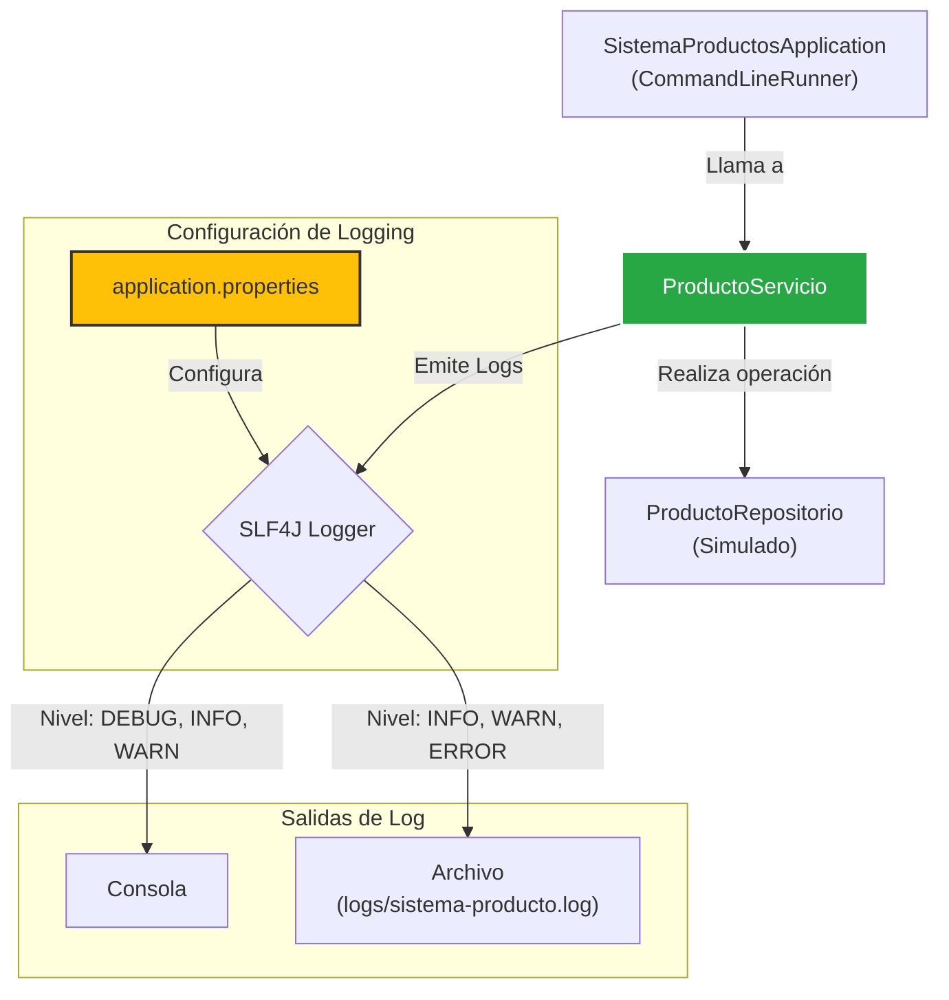

***
# Spring Boot: Configuración Avanzada de Logging

Este proyecto es una aplicación de consola construida con Spring Boot que sirve como una demostración práctica y detallada de cómo configurar el sistema de logging de una aplicación. El objetivo es ilustrar cómo gestionar niveles de log, formatos de salida y destinos de archivo utilizando `application.properties`, una habilidad esencial para desarrollar aplicaciones robustas y mantenibles.

-----

## ✨ Conceptos Clave Demostrados

Esta aplicación es un excelente ejemplo para entender los siguientes conceptos de logging y buenas prácticas:

* **Abstracción de Logging con SLF4J**: El código utiliza la API de SLF4J (`org.slf4j.Logger`), lo que permite cambiar la implementación de logging subyacente (Logback, Log4j2, etc.) sin modificar el código fuente.
* **Uso de Placeholders (`{}`)**: Se demuestra la práctica recomendada de usar placeholders (`{}`) en los mensajes de log. Esto es más eficiente que la concatenación de cadenas, ya que la construcción del mensaje solo ocurre si el nivel de log está habilitado.
* **Niveles de Logging (`DEBUG`, `INFO`, `WARN`, `ERROR`)**: Se muestra el uso práctico de diferentes niveles para categorizar la importancia de los mensajes, desde información detallada de depuración hasta errores críticos.
* **Configuración Jerárquica de Niveles**: Se ilustra cómo establecer un nivel de log global (`logging.level.root`) y luego sobreescribirlo para paquetes específicos (`logging.level.com.ecommerce.p3`), permitiendo un control granular sobre el "ruido" de los logs.
* **Salida de Logs a un Archivo**: Se configura la aplicación para que, además de la consola, escriba los logs en un archivo (`logging.file.name`), una práctica indispensable en entornos de producción.
* **Personalización del Formato de Log**: Se muestra cómo personalizar el formato de la fecha en los mensajes de log (`logging.pattern.dateformat`) para mejorar la legibilidad.

-----

## 🏗️ Estructura del Proyecto

El proyecto sigue una estructura limpia y bien definida que separa las responsabilidades.

```text
.
└── src
    ├── main
    │   ├── java
    │   │   └── com
    │   │       └── ecommerce
    │   │           └── p3
    │   │               ├── SistemaProductosApplication.java # Clase principal y ejecutora de la demo
    │   │               ├── modelo
    │   │               │   └── Producto.java              # El POJO que representa un producto
    │   │               ├── repositorio
    │   │               │   └── ProductoRepositorio.java   # Simula el acceso a datos
    │   │               └── servicio
    │   │                   └── ProductoServicio.java      # Contiene la lógica de negocio y los logs
    │   └── resources
    │       └── application.properties           # Archivo de configuración central
    └── test
        └── ...
```

-----

## 🔗 Diagrama de Flujo de Logging

El siguiente diagrama ilustra cómo fluye la lógica y cómo se generan los logs en la aplicación.



### Explicación del Flujo:

1.  **`SistemaProductosApplication`** inicia la demo a través de un `CommandLineRunner`.
2.  Llama a métodos en **`ProductoServicio`** para simular operaciones de negocio.
3.  **`ProductoServicio`** utiliza el Logger de SLF4J para emitir mensajes en diferentes niveles.
4.  El sistema de logging, configurado por **`application.properties`**, procesa estos mensajes.
5.  Debido a la configuración, los logs de nivel `DEBUG` o superior se muestran en la **Consola**, mientras que los de nivel `INFO` o superior se escriben en el **Archivo**.

-----

## 🚀 Cómo Ejecutar el Proyecto

### Prerrequisitos

* JDK 17 o superior.
* Apache Maven 3.8 o superior.

### Pasos

1.  Clona este repositorio en tu máquina local.
2.  Abre una terminal o línea de comandos en el directorio raíz del proyecto.
3.  Ejecuta el siguiente comando de Maven para compilar y arrancar la aplicación:
    ```bash
    mvn spring-boot:run
    ```
4.  Observa la salida en la consola y verifica la creación del archivo `logs/sistema-producto.log` en el directorio raíz del proyecto.

-----

## 📋 Salida Esperada

### En la Consola

Verás todos los niveles de log, incluyendo `DEBUG`, porque `logging.level.com.ecommerce.p3=DEBUG`.

```log
Iniciando operaciones simuladas
2025-07-13 10:30:00.123 DEBUG --- [              main] c.e.p.servicio.ProductoServicio      : Iniciando el proceso de guardado para el producto Monitor UltraWide: 
2025-07-13 10:30:00.124  INFO --- [              main] c.e.p.servicio.ProductoServicio      : Producto guardado exitosamente con ID 1: 
2025-07-13 10:30:00.125 DEBUG --- [              main] c.e.p.servicio.ProductoServicio      : Buscando producto con id: 1
2025-07-13 10:30:00.126  INFO --- [              main] c.e.p.servicio.ProductoServicio      : Producto encontrado con ID 1: 
2025-07-13 10:30:00.127 DEBUG --- [              main] c.e.p.servicio.ProductoServicio      : Buscando producto con id: 99
2025-07-13 10:30:00.128  WARN --- [              main] c.e.p.servicio.ProductoServicio      : No se encontró ningún producto con ID 99: 
--- Operaciones de prueba finalizadas ---
```

### En el archivo `logs/sistema-producto.log`

Solo verás los niveles `INFO`, `WARN` y `ERROR`, porque el nivel raíz (`logging.level.root=INFO`) se aplica por defecto a la salida de archivo.

```log
2025-07-13 10:30:00.124  INFO --- [              main] c.e.p.servicio.ProductoServicio      : Producto guardado exitosamente con ID 1: 
2025-07-13 10:30:00.126  INFO --- [              main] c.e.p.servicio.ProductoServicio      : Producto encontrado con ID 1: 
2025-07-13 10:30:00.128  WARN --- [              main] c.e.p.servicio.ProductoServicio      : No se encontró ningún producto con ID 99: 
```