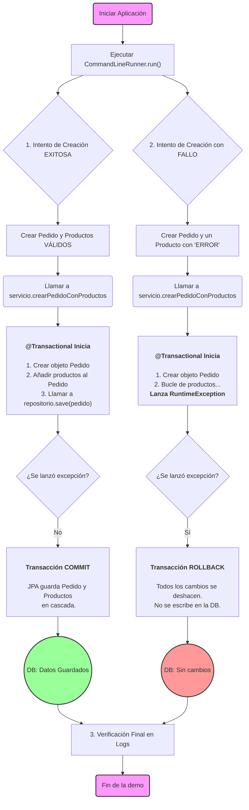

***
# Proyecto Demo: Persistencia Avanzada con Spring Data JPA

Este proyecto es una demostración técnica y detallada de patrones de persistencia avanzados utilizando **Spring Boot** y **Spring Data JPA**. Su objetivo es servir como una guía práctica y un ejemplo de código de alta calidad para implementar una capa de datos robusta, eficiente y escalable.

-----

## 🎯 Objetivo Principal

El propósito de este proyecto es ilustrar, a través de un caso de uso de una tienda online, cómo resolver problemas comunes y aplicar las mejores prácticas en el desarrollo de la capa de persistencia, incluyendo:

* **Modelado de Entidades Robusto**: Creación de relaciones bidireccionales, gestión del ciclo de vida y uso de tipos de datos correctos.
* **Técnicas de Repositorio Avanzadas**: Implementación de consultas personalizadas, derivadas y optimizadas.
* **Gestión Transaccional**: Demostración de la atomicidad de las operaciones de negocio y el manejo de `COMMIT` y `ROLLBACK`.
* **Optimización de Rendimiento**: Solución al clásico problema N+1 mediante `JOIN FETCH`.
* **Paginación y Escalabilidad**: Diseño de una API de servicio que maneja grandes volúmenes de datos de forma segura.

-----

## ✨ Características y Patrones Demostrados

#### 1\. Modelado de Entidades con JPA (`/modelo`)

* **Relación Bidireccional `@OneToMany` / `@ManyToOne`**: Se implementa una relación completa entre `Pedido` y `Producto`, donde `Pedido` es el "agregado raíz".
* **Gestión de Ciclo de Vida**: Se utiliza `cascade = CascadeType.ALL` y `orphanRemoval = true` para que JPA gestione automáticamente la persistencia de los productos hijos al modificar un pedido.
* **Precisión Financiera**: Se usa `java.math.BigDecimal` para el atributo `precio` del producto, la práctica recomendada para evitar errores de punto flotante en valores monetarios.
* **`equals()` y `hashCode()` Correctos**: Implementación robusta de estos métodos, basada en la clave primaria, crucial para el correcto funcionamiento de las entidades en colecciones y en el contexto de persistencia.

#### 2\. Repositorios de Spring Data JPA (`/repositorio`)

* **Consultas Derivadas**: Creación de consultas directamente desde el nombre del método (ej. `findByFechaCreacionBetween`).
* **Consultas Personalizadas con `@Query`**: Uso de JPQL para lógicas más complejas, como búsquedas con `LIKE`.
* **Optimización del Problema N+1**: Se incluye un método (`findByIdWithProductos`) con una consulta `LEFT JOIN FETCH` que carga un pedido y su colección de productos en una única consulta a la base de datos, previniendo problemas de rendimiento.
* **Uso de `JpaRepository`**: Se extiende de `JpaRepository` para obtener funcionalidades completas de CRUD, paginación y ordenamiento de forma nativa.

#### 3\. Capa de Servicio Transaccional (`/servicio`)

* **Atomicidad con `@Transactional`**: El método `crearPedidoConProductos` está marcado como transaccional. Esto garantiza que la creación de un pedido y todos sus productos es una operación atómica: o todo tiene éxito (`COMMIT`) o todo se deshace (`ROLLBACK`).
* **Persistencia de Agregados**: La lógica del servicio demuestra el patrón de "Aggregate Root", donde solo se necesita guardar la entidad raíz (`Pedido`), y JPA se encarga de persistir las entidades hijas (`Producto`) gracias a la configuración de cascada.
* **Paginación**: Los métodos para obtener colecciones de entidades devuelven un objeto `Page`, lo que hace que la API sea escalable y segura contra `OutOfMemoryError`.

#### 4\. Demostración en Vivo (`AplicacionTiendaOnline.java`)

* **`CommandLineRunner`**: La aplicación principal implementa esta interfaz para ejecutar un script de demostración al arrancar.
* **Prueba de `COMMIT` y `ROLLBACK`**: El script ejecuta dos escenarios:
    1.  **Caso de Éxito**: Crea un pedido válido que se persiste correctamente en la base de datos.
    2.  **Caso de Fallo**: Intenta crear un pedido con un producto cuyo nombre contiene la palabra "ERROR", lo que provoca una excepción en la capa de servicio. Se demuestra que la transacción se revierte (`ROLLBACK`) y que ni el pedido ni ninguno de sus productos se guardan.
* **Coexistencia de `JPA` y `JdbcTemplate`**: Se utiliza `JdbcTemplate` para una tarea de DDL (crear una tabla de auditoría), demostrando cómo diferentes tecnologías de acceso a datos pueden convivir en un mismo proyecto.

-----

## 📈 Diagrama de Flujo Transaccional

El siguiente diagrama ilustra la lógica ejecutada por `CommandLineRunner` para demostrar la atomicidad de las transacciones gestionadas por `@Transactional`.



-----

## 🚀 Cómo Ejecutar la Demostración

Para compilar y ejecutar este proyecto, necesitarás:

* Java JDK 17 o superior.
* Apache Maven 3.6+

<!-- end list -->

1.  Clona este repositorio.

2.  Abre una terminal en el directorio raíz del proyecto.

3.  Ejecuta el siguiente comando de Maven:

    ```sh
    mvn spring-boot:run
    ```

-----

## 🔬 Explorando el Resultado

La magia de este proyecto se ve en los **logs de la consola**. Al ejecutar la aplicación, observa la salida. Verás claramente:

1.  La creación de la tabla `auditoria` por `JdbcTemplate`.
2.  Los logs del "Caso de Éxito", mostrando el `Pedido` y los `Producto`s creados con sus respectivos IDs.
3.  Los logs del "Caso de Fallo", donde se captura una `RuntimeException`.
4.  La **verificación final**, que es la prueba definitiva:
    * La sección "Productos en la DB" mostrará **solo** los productos del pedido exitoso.
    * La sección "Pedidos en la DB" mostrará **solo** el pedido exitoso.

Esta salida confirma que la transacción del pedido fallido fue revertida exitosamente, dejando la base de datos en un estado consistente.