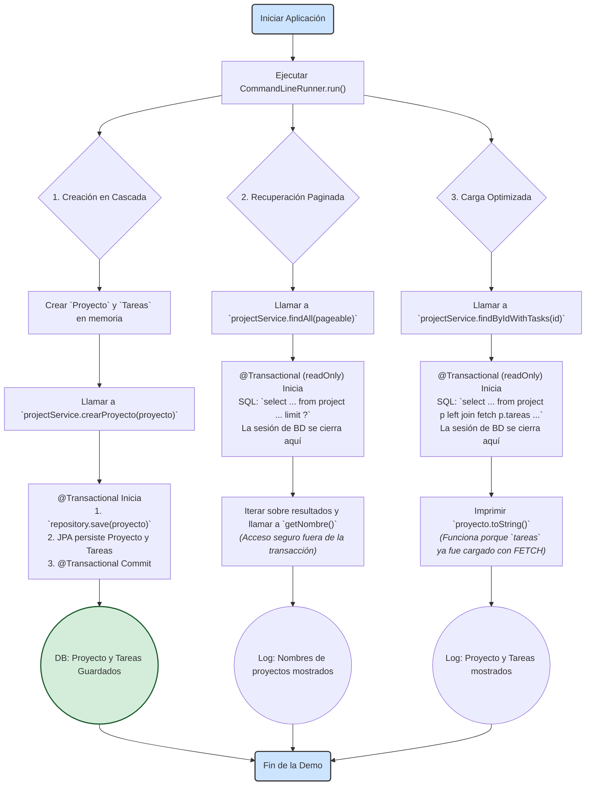

# Proyecto Demo: Gestión de Proyectos con Spring Data JPA

Este proyecto es una demostración técnica diseñada para ilustrar patrones de persistencia avanzados y mejores prácticas en el desarrollo de aplicaciones con **Spring Boot** y **Spring Data JPA**. Utilizando un caso de uso de gestión de proyectos y tareas, sirve como una guía de referencia de alta calidad para construir una capa de datos robusta, eficiente y escalable.

-----

## 🎯 Objetivos y Conceptos Demostrados

El propósito principal es mostrar soluciones a problemas comunes en la capa de persistencia, aplicando los siguientes patrones y técnicas:

#### Modelado de Entidades (Estilo DDD)

* Implementación de **Agregados**, donde `Proyecto` actúa como el "Agregado Raíz" que gestiona el ciclo de vida de sus `Tareas`.
* Mapeo de una relación bidireccional `@OneToMany` / `@ManyToOne` con gestión de consistencia a través de métodos de ayuda (`addTarea`/`removeTarea`).
* Uso correcto de `cascade = CascadeType.ALL` y `orphanRemoval = true` para que JPA maneje la persistencia de las entidades hijas de forma automática.
* Implementación robusta de `equals()` y `hashCode()` basada en la identidad de la entidad, crucial para el correcto funcionamiento en colecciones y el contexto de persistencia de JPA.

#### Capa de Repositorio Eficiente

* Uso de **consultas derivadas** de Spring Data JPA, que generan SQL a partir del nombre del método (ej. `findByProyectoId(...)`).
* Solución explícita al **problema N+1** mediante una consulta `@Query` personalizada con `JOIN FETCH`, que carga un agregado y sus colecciones hijas en una única consulta a la base de datos.

#### Servicios Transaccionales y Escalables

* Garantía de **atomicidad** en las operaciones de negocio mediante `@Transactional`.
* Diseño de API de servicio **escalable** que utiliza `Page` y `Pageable` para manejar grandes volúmenes de datos, previniendo `OutOfMemoryError` y proporcionando una base para APIs REST paginadas.

#### Configuración y Pruebas de Integración en Vivo

* Uso de una base de datos en memoria (H2) para facilitar la ejecución y las pruebas.
* Inicialización automática del esquema y los datos mediante `schema.sql` y `data.sql`.
* Implementación de un `CommandLineRunner` que actúa como un arnés de prueba para ejecutar y verificar la lógica de negocio al arrancar la aplicación.

-----

## 🏛️ Estructura del Proyecto

El código está organizado siguiendo una arquitectura por capas clara:

* **`src/main/java/com/example/proyectos`**
    * `/entidades`: Clases `@Entity` que definen el modelo de datos (Proyecto, Tarea).
    * `/repositorio`: Interfaces de Spring Data JPA (`IProjectRepository`, `ITaskRepository`) para el acceso a datos.
    * `/servicios`: Interfaces (`IProjectService`, `ITaskService`) que definen el contrato de negocio y sus implementaciones (`/impl`).
* **`src/main/resources`**:
    * `application.properties`: Configuración de la aplicación y la base de datos.
    * `schema.sql`: Script DDL para crear la estructura de las tablas.
    * `data.sql`: Script DML para poblar la base de datos con datos iniciales.

-----

## 📈 Diagrama de Flujo de la Demostración

El siguiente diagrama ilustra la secuencia de operaciones ejecutada por el `CommandLineRunner` al arrancar la aplicación. Clarifica cómo se demuestra cada uno de los patrones de persistencia clave: creación en cascada, recuperación paginada y carga optimizada para evitar `LazyInitializationException`.



-----

## 🚀 Cómo Ejecutar la Demostración

Para compilar y ejecutar este proyecto, necesitarás:

* Java JDK 17 o superior.
* Apache Maven 3.6+

Sigue estos pasos:

1.  **Clona el repositorio:**
    ```sh
    git clone <URL_DEL_REPOSITORIO>
    ```
2.  **Navega al directorio del proyecto:**
    ```sh
    cd <NOMBRE_DEL_PROYECTO>
    ```
3.  **Ejecuta la aplicación con Maven:**
    ```sh
    mvn spring-boot:run
    ```

-----

## 🔬 Explorando el Resultado

La magia de este proyecto se ve en los **logs de la consola**. Al ejecutar la aplicación, observa la salida. Verás claramente:

1.  La creación de la tabla `auditoria` por `JdbcTemplate`.
2.  Los logs del "Caso de Éxito", mostrando el `Pedido` y los `Producto`s creados con sus respectivos IDs.
3.  Los logs del "Caso de Fallo", donde se captura una `RuntimeException`.
4.  La **verificación final**, que es la prueba definitiva:
    * La sección "Productos en la DB" mostrará **solo** los productos del pedido exitoso.
    * La sección "Pedidos en la DB" mostrará **solo** el pedido exitoso.

Esta salida confirma que la transacción del pedido fallido fue revertida exitosamente, dejando la base de datos en un estado consistente.