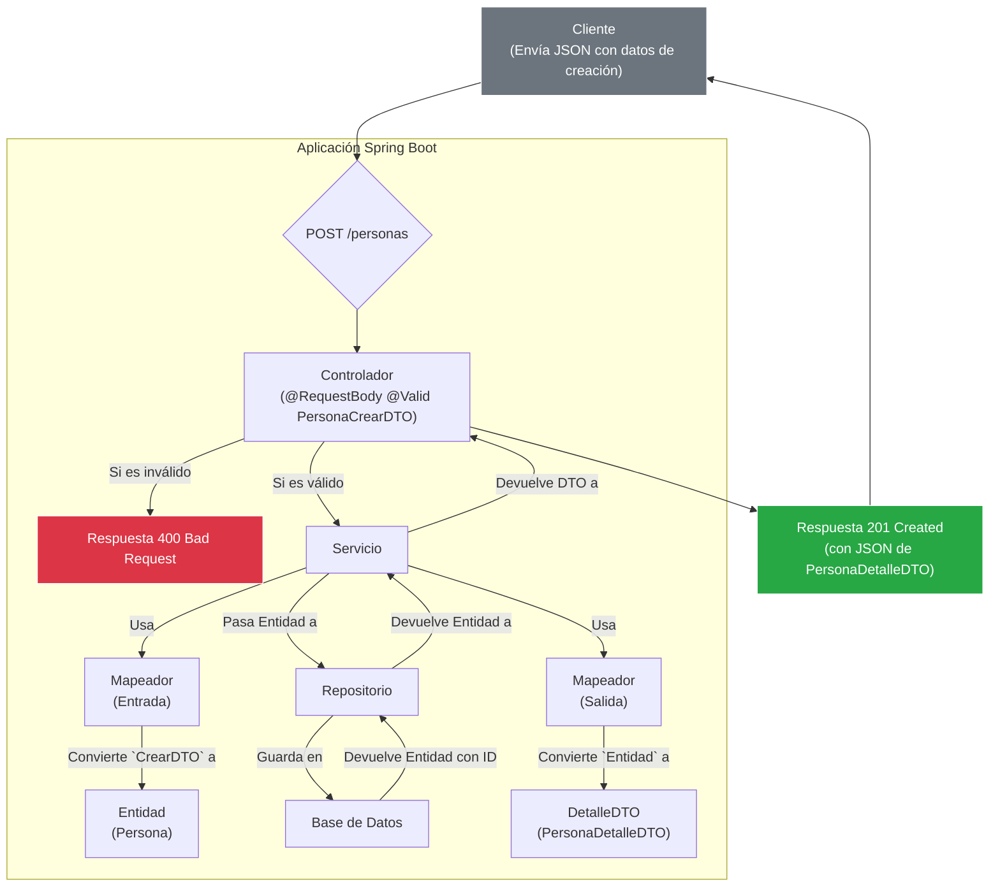

# **La Estrategia de DTOs Especializados por Caso de Uso**

## **1. Introducción**

Un error común de los desarrolladores junior es crear un único DTO genérico (ej. `PersonaDTO`) y usarlo para todo. Un desarrollador senior sabe que esto es una mala práctica que genera problemas de seguridad y mantenibilidad.

La estrategia empresarial correcta es crear **DTOs (Data Transfer Objects) específicos para cada operación o caso de uso**. Este documento desglosa esta estrategia profesional.

## **2. Tipos de DTOs y su Propósito**

### **2.1. DTOs de Entrada (Input): Lo que el Cliente Envía**

Estos DTOs definen la estructura y las reglas de los datos que la API acepta. Son el objetivo de las validaciones (`@Valid`).

### **DTO de Creación (`...CrearDTO`)**

- **Propósito:** Se usa exclusivamente para las peticiones `POST`.
- **Regla Clave:** **Nunca** contiene un campo `id`. El `id` es generado por el servidor y permitir que el cliente lo envíe es, en el mejor de los casos, confuso y, en el peor, un riesgo.
- **Características:** Contiene todas las anotaciones de validación (`@NotBlank`, `@Min`, `@Email`, etc.) para asegurar la integridad de los datos desde el principio.

### **DTO de Actualización (`...ActualizarDTO`)**

- **Propósito:** Se usa para las peticiones `PUT` o `PATCH`.
- **¿Por qué separarlo del de creación?** Porque las reglas de negocio pueden ser diferentes. Por ejemplo, quizás al actualizar una persona no se puede cambiar su correo electrónico, o ciertos campos son opcionales. Separarlos nos da esa flexibilidad sin afectar la operación de creación.

### **2.2. DTOs de Salida (Output): Lo que el Servidor Devuelve**

Estos DTOs definen la estructura de los datos que la API devuelve al cliente. No necesitan validaciones. Su propósito es modelar la "vista" de los datos.

### **DTO de Detalle (`...DetalleDTO` o `...VerDTO`)**

- **Propósito:** Se usa como respuesta al solicitar un recurso específico (ej. `GET /personas/123`) o después de una creación/actualización exitosa.
- **Características:** Representa la vista completa y detallada del recurso. **Sí incluye el `id`** y puede incluir otros campos de solo lectura generados por el sistema (como `fechaCreacion`, `fechaActualizacion`, etc.).

### **DTO de Resumen (`...ResumenDTO`)**

- **Propósito:** Este es un DTO crucial para el rendimiento. Se usa al devolver listas de recursos (ej. `GET /personas`).
- **Características:** Contiene solo un subconjunto de los campos más importantes (ej. `id`, `nombre`). Omite deliberadamente campos "pesados" o menos relevantes para una lista (como descripciones largas, arrays complejos, etc.). Esto mantiene los *payloads* (la cantidad de datos transferidos) pequeños y hace que la API sea mucho más rápida y eficiente.

## **3. La Capa de Mapeo (Mappers): El Pegamento**

Ahora tenemos entidades y varios DTOs. ¿Cómo los convertimos entre sí? Hacerlo manualmente en la capa de servicio es repetitivo y propenso a errores.

La solución profesional es crear una **capa de Mapeo**.

- **Propósito:** Componentes dedicados cuya única responsabilidad es convertir un objeto de un tipo a otro (ej. `PersonaCrearDTO` -> `Persona`, o `Persona` -> `PersonaDetalleDTO`).
- **Herramientas:**
    - **MapStruct:** Es la herramienta preferida en el ecosistema Java a nivel empresarial. Es un generador de código que crea las implementaciones de mapeo en tiempo de compilación. Es extremadamente rápido (cero sobrecarga en tiempo de ejecución) y seguro (falla en la compilación si los mapeos son ambiguos).
    - **ModelMapper:** Otra biblioteca popular, pero usa reflexión en tiempo de ejecución, lo que la hace un poco más lenta y menos segura que MapStruct.

## **4. El Flujo de Trabajo Completo (Ejemplo `POST /personas`)**

Este diagrama ilustra el flujo completo de una petición de creación, destacando el rol de cada componente y DTO.

1. **Petición:** El cliente envía un JSON que coincide con la estructura de `PersonaCrearDTO`.
2. **Controlador:** El endpoint del controlador recibe el cuerpo de la petición en un objeto `@RequestBody @Valid PersonaCrearDTO`.
3. **Validación:** Spring automáticamente valida el DTO. Si falla, devuelve un error `400 Bad Request`.
4. **Servicio:** El controlador pasa el `PersonaCrearDTO` a la capa de servicio.
5. **Mapeo (Entrada):** El servicio utiliza el `PersonaMapper` para convertir el `PersonaCrearDTO` en una entidad `Persona`.
6. **Persistencia:** El servicio guarda la nueva entidad `Persona` en la base de datos. La base de datos le asigna un `id`.
7. **Mapeo (Salida):** El servicio toma la entidad `Persona` recién guardada (que ya tiene `id`) y usa el `PersonaMapper` para convertirla en un `PersonaDetalleDTO`.
8. **Respuesta:** El servicio devuelve el `PersonaDetalleDTO` al controlador.
9. **Respuesta HTTP:** El controlador devuelve una respuesta `201 Created` con el `PersonaDetalleDTO` en el cuerpo.

## **5. Conclusión**

Esta estrategia de DTOs especializados y una capa de mapeo dedicada es el **estándar de oro** en el desarrollo de APIs empresariales porque ofrece:

- **Seguridad:** Protege tu modelo de datos interno y previene la manipulación de campos no deseados.
- **Claridad:** El contrato de la API es explícito y fácil de entender para cada operación.
- **Mantenibilidad:** Puedes cambiar tu modelo de base de datos sin romper tu API pública, y viceversa.
- **Rendimiento:** Te permite optimizar las respuestas de la API para ser rápidas y eficientes.