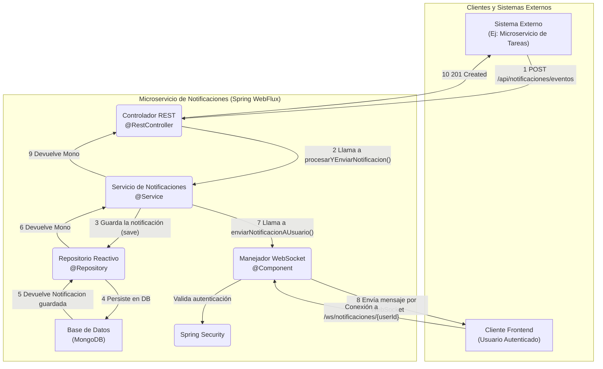

# **Microservicio de Notificaciones Reactivo**

Un microservicio de alto rendimiento construido con Spring WebFlux para gestionar y entregar notificaciones en tiempo real a través de WebSockets. El proyecto está diseñado siguiendo un paradigma completamente reactivo de extremo a extremo, garantizando una alta concurrencia y un uso eficiente de los recursos.

## **✨ Características Principales**

- **Stack 100% Reactivo:** Utiliza Spring WebFlux, Project Reactor y Spring Data Reactive MongoDB para un manejo de datos asíncrono y no bloqueante.
- **Notificaciones en Tiempo Real:** Implementa WebSockets para una comunicación bidireccional y eficiente, permitiendo el "empuje" (push) de notificaciones a los clientes conectados.
- **Seguridad Integrada:** Asegura tanto los endpoints REST como las conexiones WebSocket utilizando Spring Security, con autorización basada en roles y a nivel de método.
- **Arquitectura Limpia y Desacoplada:** Sigue una arquitectura en capas (controlador, servicio, repositorio) que promueve la mantenibilidad y la separación de responsabilidades.
- **Persistencia Eficiente:** Almacena el historial de notificaciones en MongoDB, una base de datos NoSQL ideal para la flexibilidad de esquemas y la escalabilidad.

## **🏛️ Arquitectura del Sistema**

El siguiente diagrama ilustra los dos flujos principales de la aplicación: la recepción de un evento externo que genera una notificación y la conexión de un cliente para recibirla en tiempo real.



## **🛠️ Tecnologías Utilizadas**

- **Lenguaje:** Java 17
- **Framework Principal:** Spring Boot 3
- **Stack Reactivo:** Spring WebFlux, Project Reactor
- **Comunicación en Tiempo Real:** Spring WebSockets
- **Seguridad:** Spring Security
- **Persistencia:** Spring Data Reactive MongoDB
- **Base de Datos:** MongoDB
- **Gestión de Dependencias:** Maven
- **Utilidades:** Lombok

## **🚀 Cómo Empezar**

Sigue estos pasos para tener una copia del proyecto funcionando en tu máquina local.

### **Prerrequisitos**

- JDK 17 o superior.
- Apache Maven 3.6+
- Una instancia de MongoDB corriendo. Docker es una excelente opción para esto:

    ```
    docker run -d -p 27017:27017 --name mongo-notifications mongo
    
    ```


### **Instalación**

1. **Clona el repositorio:**

    ```
    git clone <URL_DE_TU_REPOSITORIO>
    
    ```

2. **Navega al directorio del proyecto:**

    ```
    cd notificaciones
    
    ```


## **⚙️ Configuración de Entorno**

El proyecto se configura a través del archivo `src/main/resources/application.properties`.

La configuración principal que debes verificar es la URI de conexión a MongoDB:

```
# Configuración de MongoDB
spring.data.mongodb.uri=mongodb://localhost:27017/notificaciones_db

```

Asegúrate de que la URI apunte a tu instancia de MongoDB. Si usaste el comando de Docker anterior, esta configuración funcionará sin cambios.

## **🏃 Ejecución de la Aplicación**

- **Para ejecutar la aplicación en modo de desarrollo:**

    ```
    mvn spring-boot:run
    
    ```

  La API estará disponible en `http://localhost:8080`.

- **Para construir el archivo JAR para producción:**

    ```
    mvn clean package
    
    ```

  Luego puedes ejecutar el JAR con:

    ```
    java -jar target/notificaciones-0.0.1-SNAPSHOT.jar
    
    ```


## **🧪 Ejecución de las Pruebas**

Para ejecutar la suite de pruebas unitarias y de integración, utiliza el siguiente comando:

```
mvn test

```

## **📖 Documentación de la API**

### **Endpoints REST**

La base de la API se encuentra en `/api/notificaciones`.

| **Verbo** | **Endpoint** | **Seguridad** | **Descripción** |
| --- | --- | --- | --- |
| `POST` | `/eventos` | `permitAll()` | Recibe un evento externo para crear y distribuir una nueva notificación. |
| `GET` | `/historial` | `isAuthenticated()` | Obtiene el historial de notificaciones para el usuario autenticado. Acepta el query param `?leida=true/false`. |
| `GET` | `/historial/todas` | `hasRole('ADMIN')` | Obtiene el historial de todas las notificaciones. Solo para administradores. |
| `PUT` | `/{id}/leida` | `isAuthenticated()` | Marca una notificación específica como leída. El usuario solo puede marcar sus propias notificaciones. |

### **Endpoint WebSocket**

- **URL:** `/ws/notificaciones/{identificadorUsuario}`
- **Seguridad:** Requiere autenticación (HTTP Basic en este ejemplo).

Un cliente debe establecer una conexión WebSocket a esta URL, reemplazando `{identificadorUsuario}` con su propio nombre de usuario (ej. `/ws/notificaciones/usuario`). Una vez conectado, el servidor enviará notificaciones en formato JSON a medida que se generen.