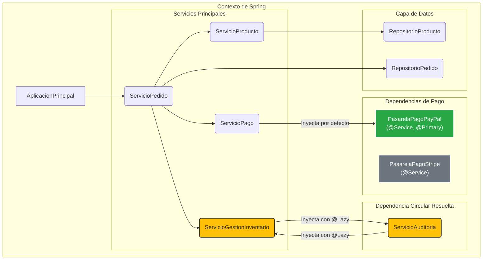

***
# Sistema de Gestión de Pedidos - Demo Avanzada de Spring Boot

Este proyecto es una aplicación de demostración construida con Spring Boot que ilustra conceptos fundamentales y avanzados de la inyección de dependencias (DI) y el diseño de software en un entorno empresarial.

El objetivo es ofrecer un caso de estudio práctico y claro sobre cómo el contenedor de Inversión de Control (IoC) de Spring gestiona y "cablea" los componentes de una aplicación, resolviendo escenarios complejos como la ambigüedad de beans y las dependencias circulares.

-----

## Conceptos Clave Demostrados

Esta aplicación sirve como un ejemplo práctico para los siguientes conceptos de Spring y buenas prácticas de desarrollo:

* **Inyección de Dependencias por Constructor**: La práctica recomendada para inyectar dependencias obligatorias, garantizando la inmutabilidad y un estado de objeto válido.
* **Ambigüedad de Beans**: El escenario donde múltiples beans (`PasarelaPagoPayPal`, `PasarelaPagoStripe`) implementan la misma interfaz (`PasarelaPago`).
* **Resolución de Ambigüedad con `@Primary`**: Cómo designar un bean como la opción por defecto cuando existen múltiples candidatos.
* **Resolución de Ambigüedad con `@Qualifier`**: Cómo indicarle a Spring exactamente cuál bean inyectar cuando se necesita una implementación específica que no es la primaria.
* **Dependencias Circulares**: Simulación de un ciclo de dependencias entre `ServicioGestionInventario` y `ServicioAuditoria`.
* **Resolución de Ciclos con `@Lazy`**: Cómo romper un ciclo de dependencias en tiempo de inicialización, difiriendo la creación de uno de los beans hasta que sea realmente necesario.
* **Estereotipos de Spring**: Uso de anotaciones como `@Service` y `@Repository` para definir el rol de cada componente.
* **Programación Orientada a Interfaces**: Definir contratos claros que son implementados por clases concretas, promoviendo un bajo acoplamiento.
* **Logging Profesional**: Uso de `SLF4J` para un registro de eventos robusto y configurable, en lugar de `System.out.println`.
* **Excepciones Personalizadas**: Creación de excepciones específicas del dominio (`StockInsuficienteException`) para un manejo de errores más claro.
* **Reducción de Código Repetitivo con Lombok**: Uso de `@Data` para mantener las clases del modelo limpias y concisas.

-----

## Arquitectura y Flujo de Inyección

El núcleo de la demostración reside en cómo se construyen los servicios y cómo Spring resuelve sus dependencias.

1.  **`ServicioPago`**: Este servicio depende de una `PasarelaPago`. Como existen dos implementaciones, Spring utiliza la anotada con `@Primary` (`PasarelaPagoPayPal`) por defecto.
2.  **`ServicioGestionInventario` y `ServicioAuditoria`**: Estos dos servicios se necesitan mutuamente, creando una dependencia circular. Para evitar un `BeanCurrentlyInCreationException`, se utiliza `@Lazy` en los puntos de inyección. Esto le indica a Spring que cree un proxy para la dependencia y solo la instancie completamente la primera vez que se utilice uno de sus métodos.

-----

## Diagrama de Dependencias Clave



-----

## Estructura del Proyecto

```text
src/main/java/com/example/p10/
├── AplicacionPrincipal.java          # Punto de entrada y orquestador de la demo
├── contratos/
│   ├── PasarelaPago.java           # Contrato para pasarelas de pago
│   ├── RepositorioPedido.java      # Contrato para el repositorio de pedidos
│   └── RepositorioProducto.java    # Contrato para el repositorio de productos
├── excepcion/
│   └── StockInsuficienteException.java # Excepción personalizada de dominio
├── implementacion/
│   ├── PasarelaPagoPayPal.java       # Implementación @Primary de PasarelaPago
│   └── PasarelaPagoStripe.java       # Implementación secundaria de PasarelaPago
├── modelo/
│   ├── Pedido.java                   # Entidad Pedido (con Lombok)
│   └── Producto.java                 # Entidad Producto (con Lombok)
├── repositorio/
│   ├── RepositorioPedidoImpl.java    # Implementación del repositorio de pedidos
│   └── RepositorioProductoImpl.java  # Implementación del repositorio de productos
└── servicio/
    ├── ServicioAuditoria.java        # Parte del ciclo de dependencia
    ├── ServicioGestionInventario.java# Parte del ciclo de dependencia
    ├── ServicioPago.java             # Utiliza la pasarela de pago @Primary
    ├── ServicioPedido.java           # Servicio principal que integra todo
    └── ServicioProducto.java         # Lógica de negocio para productos
```

-----

## Cómo Ejecutar el Proyecto

### Prerrequisitos

* JDK 17 o superior.
* Apache Maven 3.8 o superior.
* Un IDE con soporte para Lombok (la mayoría lo tienen, pero puede requerir un plugin).

### Pasos

1.  Clona este repositorio en tu máquina local.
2.  Abre una terminal o línea de comandos en el directorio raíz del proyecto (donde se encuentra el archivo `pom.xml`).
3.  Ejecuta el siguiente comando de Maven para compilar y arrancar la aplicación:
    ```bash
    mvn spring-boot:run
    ```
4.  Observa la salida en la consola para verificar el comportamiento del ciclo de vida y la inyección de dependencias.

-----

## Salida Esperada en Consola

La salida en la consola demostrará claramente la secuencia de eventos. Presta especial atención a los siguientes mensajes:

* **Inicialización de beans**: Verás cómo se inicializan los servicios, incluyendo la resolución de `@Primary` y el uso de proxies para `@Lazy`.
* **Flujo de pedido**: Seguirás la creación de un pedido, la verificación de inventario y el procesamiento del pago.
* **Manejo de errores**: Observarás cómo se captura y gestiona la `StockInsuficienteException` de forma controlada.

<!-- end list -->

```log
INFO --- [main] c.e.p.s.ServicioPago : ServicioPago inicializado con la pasarela por defecto: PayPal
INFO --- [main] c.e.p.s.ServicioGestionInventario : ServicioGestionInventario inicializado (proxy para ServicioAuditoria).
INFO --- [main] c.e.p.s.ServicioAuditoria : ServicioAuditoria inicializado (proxy para ServicioGestionInventario).
...
INFO --- [main] com.example.p10.AplicacionPrincipal : --- Ejecutando demostración del Sistema de Gestión de Pedidos ---

INFO --- [main] com.example.p10.AplicacionPrincipal : --- 1. Creando un nuevo pedido exitoso ---
INFO --- [main] c.e.p.s.ServicioPedido : Iniciando creación de pedido con 2 productos.
INFO --- [main] c.e.p.s.ServicioGestionInventario : Verificando inventario del producto 1
WARN --- [main] c.e.p.s.ServicioAuditoria : AUDITORIA: Inventario verificado para producto 1
...
INFO --- [main] c.e.p.s.ServicioPedido : Pedido 1 creado exitosamente.
INFO --- [main] com.example.p10.AplicacionPrincipal : Pedido creado: ID 1, Estado: PENDIENTE, Total: $1250.0

INFO --- [main] com.example.p10.AplicacionPrincipal : --- 2. Procesando pago del pedido 1 ---
INFO --- [main] c.e.p.s.ServicioPedido : Intentando procesar pago para el pedido 1
INFO --- [main] c.e.p.i.PasarelaPagoPayPal : Processing payment of $1250.0 through PayPal...
INFO --- [main] c.e.p.s.ServicioPedido : Pago del pedido 1 procesado con éxito.
INFO --- [main] com.example.p10.AplicacionPrincipal : Estado del pedido después del pago: PAGADO

INFO --- [main] com.example.p10.AplicacionPrincipal : --- 3. Intentando crear otro pedido con stock limitado ---
ERROR--- [main] com.example.p10.AplicacionPrincipal : ERROR CONTROLADO: Stock insuficiente para Laptop Gamer Pro. Solicitado: 10, Disponible: 9

INFO --- [main] com.example.p10.AplicacionPrincipal : --- Demostración finalizada ---
```