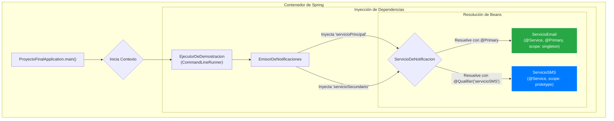

***
# Servicio de Notificaciones - Demo de Conceptos Fundamentales de Spring

Este proyecto es una aplicación de consola construida con Spring Boot diseñada como una demostración práctica y clara de los conceptos fundamentales del framework Spring, especialmente la **Inversión de Control (IoC)** y la **Inyección de Dependencias (DI)**.

El objetivo es ilustrar cómo Spring gestiona el ciclo de vida de los objetos (beans), resuelve dependencias y permite construir aplicaciones modulares y desacopladas.

-----

## ✨ Conceptos Clave Demostrados

Esta aplicación sirve como un ejemplo práctico para los siguientes conceptos de Spring y buenas prácticas de desarrollo:

* **Inyección de Dependencias por Constructor**: La práctica recomendada para inyectar dependencias obligatorias, garantizando la inmutabilidad y un estado de objeto válido desde su creación.
* **Escaneo de Componentes**: Cómo Spring descubre y registra beans automáticamente mediante anotaciones de estereotipo como `@Component` y `@Service`.
* **Resolución de Ambigüedad de Beans**:
    * `@Primary`: Se utiliza en `ServicioEmail` para designarlo como el bean por defecto cuando múltiples implementaciones de `ServicioDeNotificacion` están disponibles.
    * `@Qualifier`: Se usa en el constructor de `EmisorDeNotificaciones` para solicitar explícitamente la implementación `servicioSMS`, resolviendo la ambigüedad de forma precisa.
* **Ciclo de Vida de Beans (Lifecycle Hooks)**:
    * `@PostConstruct`: Demostrado en `ServicioEmail` para ejecutar lógica de inicialización (como conectar a un recurso) justo después de que el bean es creado.
    * `@PreDestroy`: Usado para ejecutar lógica de limpieza (como liberar recursos) justo antes de que el bean sea destruido.
* **Alcances de Bean (Bean Scopes)**:
    * **singleton** (por defecto): `ServicioEmail` es un singleton. El contenedor de Spring crea una única instancia y la reutiliza en toda la aplicación.
    * **prototype**: `ServicioSMS` tiene este alcance. El contenedor crea una nueva instancia cada vez que se solicita el bean.
* **Programación Orientada a Interfaces**: El código depende de la abstracción `ServicioDeNotificacion` en lugar de implementaciones concretas, promoviendo el bajo acoplamiento y la flexibilidad.
* **Ejecución de Lógica al Arranque**: Se utiliza un `CommandLineRunner` (`EjecutorDeDemostracion`) para orquestar la demostración, manteniendo la clase principal de la aplicación limpia.

-----

## 🏗️ Estructura del Proyecto

La estructura está organizada para separar claramente las responsabilidades: contratos (interfaces), implementaciones (servicios) y componentes de la aplicación.

```text
.
└── src
    └── main
        └── java
            └── com
                └── example
                    └── pf
                        ├── ProyectoFinalApplication.java   # Punto de entrada de la aplicación
                        ├── EjecutorDeDemostracion.java     # Orquesta la lógica de la demo
                        ├── componente
                        │   └── EmisorDeNotificaciones.java # Utiliza los servicios de notificación
                        ├── contrato
                        │   └── ServicioDeNotificacion.java # Define el contrato para los servicios
                        └── servicio
                            ├── ServicioEmail.java          # Implementación Singleton y @Primary
                            └── ServicioSMS.java            # Implementación Prototype
```

-----

## 💎 Diagrama de Dependencias Clave

Este diagrama ilustra cómo el contenedor de Spring construye y conecta los componentes (beans) de la aplicación en tiempo de ejecución.



### Flujo de la Inyección:

1.  La aplicación arranca y el `EjecutorDeDemostracion` es creado.
2.  Para construir el `EjecutorDeDemostracion`, Spring necesita un `EmisorDeNotificaciones`.
3.  Para construir el `EmisorDeNotificaciones`, Spring necesita dos beans que implementen `ServicioDeNotificacion`.
4.  Para el primer parámetro (`servicioPrincipal`), Spring busca un candidato y encuentra dos. Como `ServicioEmail` está marcado con `@Primary`, lo elige como la opción por defecto.
5.  Para el segundo parámetro (`servicioSecundario`), la anotación `@Qualifier("servicioSMS")` le indica a Spring que ignore la opción primaria y busque explícitamente el bean con el nombre "servicioSMS".
6.  Una vez resueltas todas las dependencias, los beans son creados y la aplicación está lista para ejecutarse.

-----

## 🚀 Cómo Ejecutar el Proyecto

### Prerrequisitos

* JDK 17 o superior.
* Apache Maven 3.8 o superior.

### Pasos

1.  Clona este repositorio en tu máquina local.
2.  Abre una terminal o línea de comandos en el directorio raíz del proyecto (donde se encuentra el archivo `pom.xml`).
3.  Ejecuta el siguiente comando de Maven para compilar y arrancar la aplicación:
    ```bash
    mvn spring-boot:run
    ```
4.  Observa la salida en la consola para verificar el comportamiento de cada uno de los conceptos demostrados.

-----

## 📋 Salida Esperada en Consola

La salida en la consola demostrará claramente la secuencia de eventos. Presta especial atención a los siguientes mensajes:

* **Inicialización de beans**: Verás el mensaje `@PostConstruct` de `ServicioEmail` y la creación del `EmisorDeNotificaciones`.
* **Inyección de dependencias**: El constructor de `EmisorDeNotificaciones` será llamado, y una instancia de `ServicioSMS` será creada para satisfacer la dependencia con `@Qualifier`.
* **Demostración de `prototype`**: Se crearán dos instancias distintas de `ServicioSMS`, y la comparación de objetos dará como resultado `false`.
* **Destrucción de beans**: Al finalizar, verás el mensaje `@PreDestroy` de `ServicioEmail` (nota que los beans `prototype` no son destruidos por Spring).

<!-- end list -->

```log
// --- Fase de Inicialización del Contexto de Spring ---
INFO --- [              main] c.e.p.servicio.ServicioEmail           : ServicioEmail: @PostConstruct - Inicializando conexion al servidor de correo...
INFO --- [              main] c.e.p.servicio.ServicioSMS             : Creando instancia de ServicioSMS #1
INFO --- [              main] c.e.p.componente.EmisorDeNotificaciones  : Creando instancia de EmisorDeNotificaciones
INFO --- [              main] c.e.p.ProyectoFinalApplication         : Started ProyectoFinalApplication in ...

// --- Fase de Ejecución de la Lógica de la Aplicación (CommandLineRunner) ---
INFO --- [              main] com.example.pf.EjecutorDeDemostracion    : 
[1. Probando inyección por defecto (@Primary)]
INFO --- [              main] c.e.p.componente.EmisorDeNotificaciones  : Usando servicio principal
INFO --- [              main] c.e.p.servicio.ServicioEmail           : ServicioEmail: Enviando correo: Este es un mensaje de bienvenida

INFO --- [              main] com.example.pf.EjecutorDeDemostracion    : 
[2. Probando inyección explicita (@Qualifier)]
INFO --- [              main] c.e.p.componente.EmisorDeNotificaciones  : Usando servicio secundaria
INFO --- [              main] c.e.p.servicio.ServicioSMS             : (Instancia SMS #1) Enviando SMS: Este es un aviso urgente por SMS

INFO --- [              main] com.example.pf.EjecutorDeDemostracion    : 
[3. Probando el scope 'prototype']
INFO --- [              main] com.example.pf.EjecutorDeDemostracion    : Solicitando la primera instancia de ServicioSMS...
INFO --- [              main] c.e.p.servicio.ServicioSMS             : Creando instancia de ServicioSMS #2
INFO --- [              main] c.e.p.servicio.ServicioSMS             : (Instancia SMS #2) Enviando SMS: Primer mensaje de prueba

INFO --- [              main] com.example.pf.EjecutorDeDemostracion    : Solicitando la segunda instancia de ServicioSMS...
INFO --- [              main] c.e.p.servicio.ServicioSMS             : Creando instancia de ServicioSMS #3
INFO --- [              main] c.e.p.servicio.ServicioSMS             : (Instancia SMS #3) Enviando SMS: Segunda mensaje de prueba

INFO --- [              main] com.example.pf.EjecutorDeDemostracion    : ¿Son las dos instancias de SMS el mismos objeto? --> false
INFO --- [              main] com.example.pf.EjecutorDeDemostracion    : 
--- FIN DE LA DEMOSTRACIÓN ---

// --- Fase de Cierre de la Aplicación ---
INFO --- [ionShutdownHook] c.e.p.servicio.ServicioEmail           : ServicioEmail: @PreDestroy - Desconectando el servidor de correo...
```